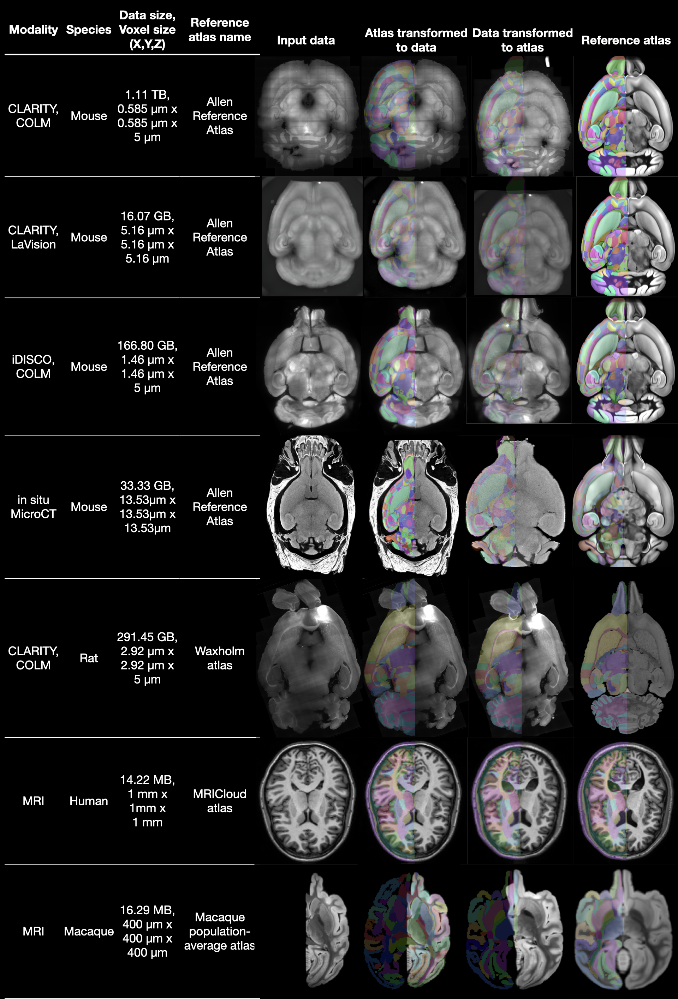

..  -*- coding: utf-8 -*-

.. _contents:

Overview of CloudReg
====================

Motivation
----------
Quantifying terascale multi-modal human and animal imaging data requires scalable analysis tools. We developed CloudReg, an automated, terascale, cloud-compliant image analysis pipeline for preprocessing and cross-modal, non-linear registration between volumetric datasets with artifacts. CloudReg was developed using cleared murine brain light-sheet microscopy images, but is also accurate in registering the following datasets to their respective atlases: in vivo human and ex vivo macaque brain magnetic resonance imaging, ex vivo murine brain micro-computed tomography.

Pipeline Overview
-----------------
.. figure:: _static/cloudreg_schematic.png
   :alt: CloudReg pipeline schematic showing example data through each step of processing

   CloudReg pipeline schematic showing example data through each step of processing. The gray box indicates operations/services that are performed in the cloud.

Example Results
---------------

   Each row demonstrates registration of either mouse, rat, macaque, or human brain imaging data to the corresponding atlas using CloudReg. The leftmost column of images shows the input data; the data from the autofluorescence channel is used for samples imaged with a light-sheet microscope (LSM). The rightmost column shows the atlas parcellations overlaid on one hemisphere of the atlas image data. The second and third columns show the respective atlas parcellations transformed to and overlaid on the original samples and vice-versa, respectively. CLARITY, Clear Lipid-exchanged Anatomically Rigid Imaging/immunostaining-compatible Tissue Hydrogel; COLM, CLARITY-Optimized Light-sheet Microscopy; GB, Gigabyte; iDISCO, immunolabeling-enabled three-dimensional imaging of solvent-cleared organs; MB, Megabyte; Micro-CT, Micro-Computed Tomography; TB, Terabyte.

Documentation
=============

.. toctree::
   :maxdepth: 1

   setup
   run
   reference/index
   license

.. toctree::
   :maxdepth: 1
   :caption: Useful Links

   CloudReg @ GitHub <http://www.github.com/neurodata/CloudReg/>

Indices and tables
==================

* :ref:`genindex`
* :ref:`modindex`
* :ref:`search`
