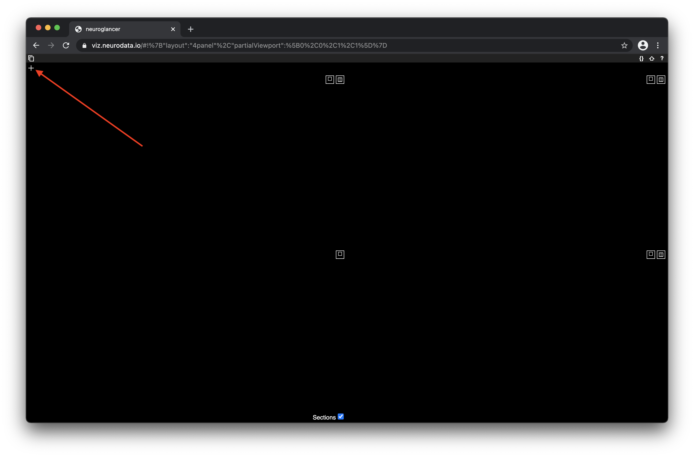
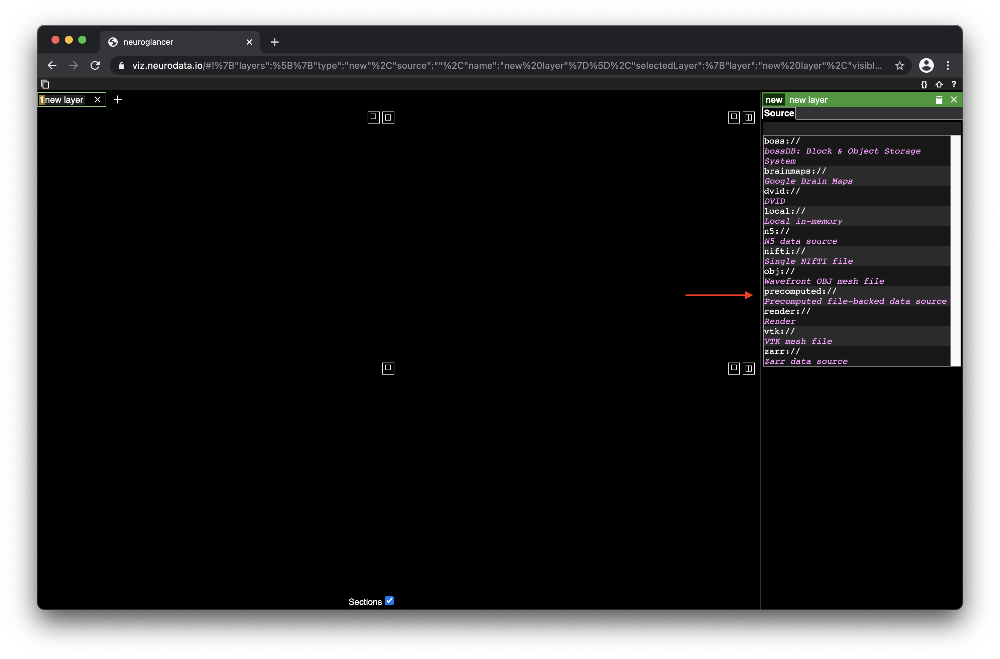
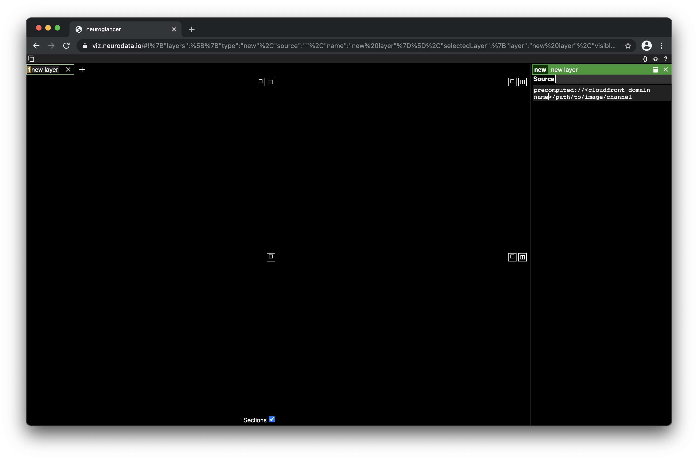
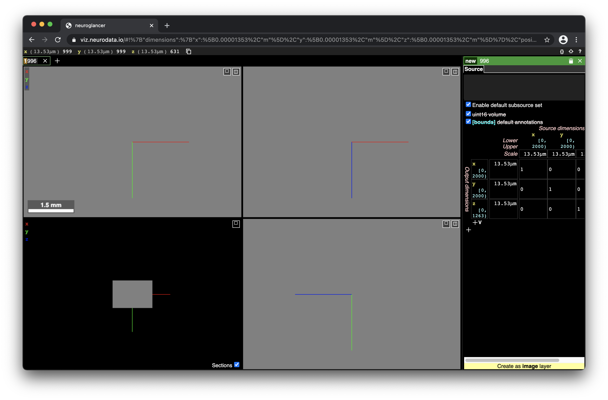

Run
===

Once you have followed all instructions on the setup page we can begin using CloudReg.

Requirements
------------
All of the below commands can be run from your local machine terminal and will automatically start and stop a remote cloud server. This requires that the local machine have continued access to the internet for the period of time the pipeline is running. This can be running in the background while you use your machine. 
In order to run the below commands, raw multi-FOV data should be uploaded to raw data S3 bucket (created in setup) in `COLM format <https://www.nature.com/articles/nprot.2014.123>`_ . This can be done with `awscli`

Preprocessing
-------------
The below steps are to run local intensity correction, stitching, global intensity corection, and upload back to S3 for visualiztion with neuroglancer.

1. Open a new Terminal window and Navigate to the CloudReg directory
2. Run `source cloudreg_env/bin/activate`
3. Run `python -m cloudreg.scripts.run_colm_pipeline_ec2 -ssh_key_path <path to ssh key from set up> -instance_id <instance id> -input_s3_path <s3://path/to/raw/data> -output_s3_path <s3://path/to/output/data> -num_channels <number of channels imaged in raw data> -autofluorescence_channel <integer between 0 and max number of channels>`

Replace the above parameters between "<>" with your own. In order to get more information about the parameters ru:
`python -m cloudreg.scripts.run_col_pipeline_ec2 -h`

Registration
------------
The following commands can be used to register mouse brain data. For more information on how to register any two image volumes in precomputed format see `<https://cloudreg.neurodata.io#cloudreg.scripts.run_registration_ec2.run_registration>`_ about paramters

1. Open a new Terminal window and Navigate to the CloudReg directory
2. Run `source cloudreg_env/bin/activate`
3. Run 
    `python -m cloudreg.scripts.run_registration_ec2 -ssh_key_path <path to ssh key from set up> -instance_id <instance id> -input_s3_path <s3://path/to/raw/data> -output_s3_path <s3://path/to/output/data>  -orientation <3-letter orientation scheme <http://www.grahamwideman.com/gw/brain/orientation/orientterms.htm>> >`

4. The above command will print out a Neuroglancer visulization link showing the affine initialization of the registration that you can view in a web browser (Chrome or Firefox).
5a. If your input data and the atlas look sufficiently aligned (only rough alignment is necessary), in your terminal type 'y' and hit enter at the prompt.
5b. If your input data and the atlas DO NOT look sufficiently aligned, the alignment can be adjusted with translation and rotation parameters (See <https://cloudreg.neurodata.io#cloudreg.scripts.run_registration_ec2.run_registration> for more information on script parameters.)

Visualization
-------------
All visualization is enabled through Neurodata's deployment of Neuroglancer: <https://viz.neurodata.io>
In order to visualize your data you will need the CloudFront Domain Name created during setup.

1. Go to <https://viz.neurodata.io> in a web browser. 
2. Click on the '+' on the top left of the Neuroglancer window (see image below). |ngl1|
3. In the window that appears on the right side, choose precomputed from the drop-down menu (see image below). |ngl2|
4. After 'precomputed://' type the S3 path to the image layer (same as output_s3_path in preprocessing step above). |ngl3|
5. If you have CloudFront set up, you can replace the 's3://' with your cloudfront domain name. |ngl4|
6. Hit enter and click "Create Image Layer" in the botom right of the Neurglancer window. |ngl5|
7. The data should start to load in 3 of the 4 quadrants. The bottom left quadrant is a 3D view of slices.

Hit 'h' while in a Neuroglancer window to view the help window.